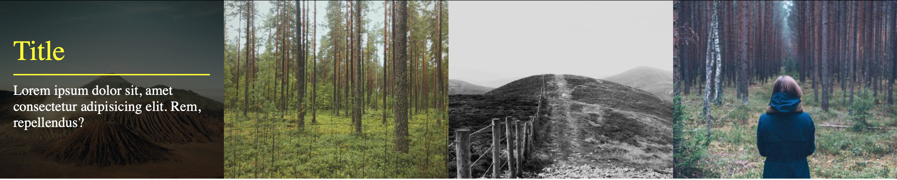
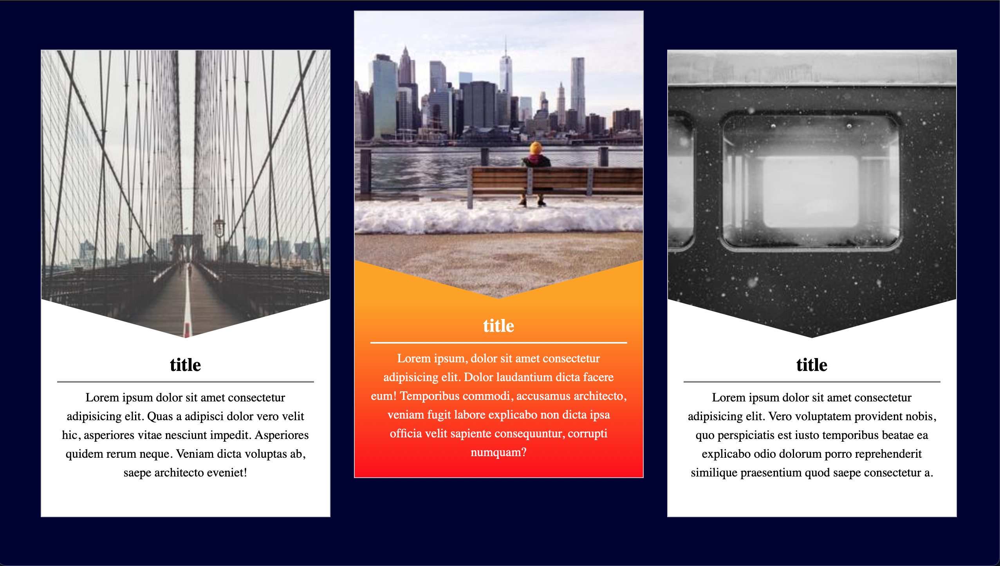
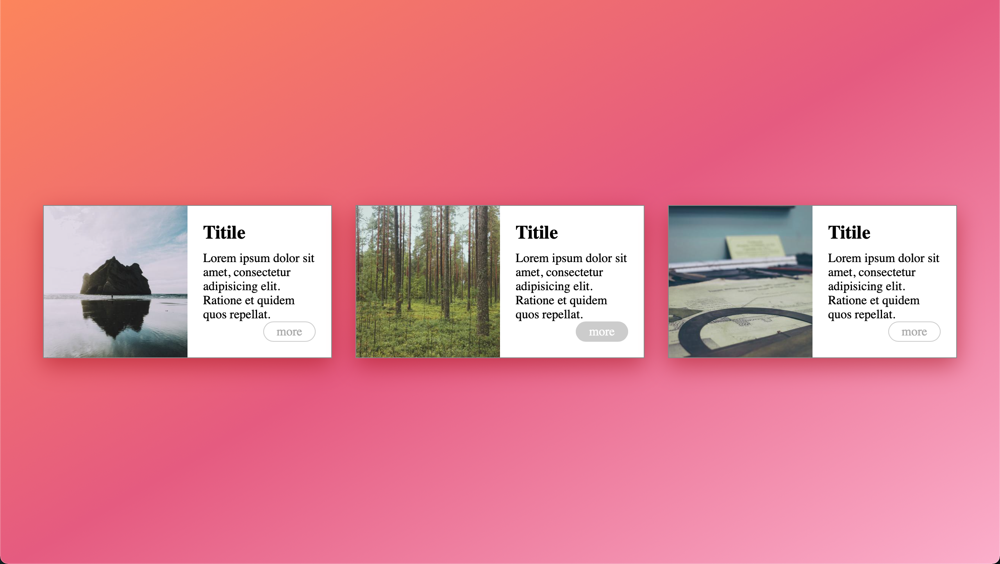
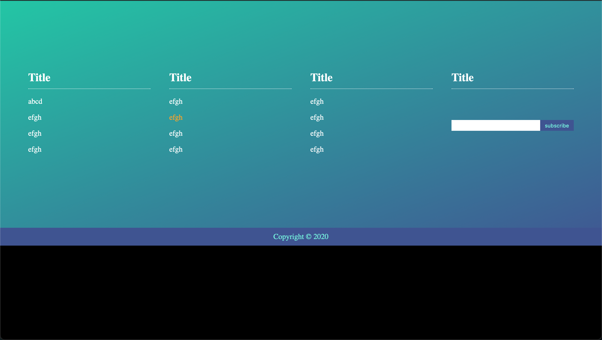

# 金魚系列-切版練習

## Multiple background
* CSS reset
* flex-direction原理
* background: 漸層色彩與多重背景撰寫方式
* 100vh 螢幕高度
* 

## Gallery
* positiom: absolute/ relative
* transition: 父層hover,子層做事情
* 偽元素(before,after):增加網頁互動效果
* 

## Introduction
* 三角形製作方式
* transform: ex:translation可以製作跳出來focus的效果
* 

## Staggered and Floating ????
* 背景半透明

## Horizontal layout
* border-shadow: x軸 y軸 模糊程度 顏色
* align-self: flex-start/ flex-end/ strech ... (置左置中置右的概念)
* object-fit: cover (填滿元素的寬度及高度(維持原比例)，通常會剪掉部分的物件)
* 

## Footer
* width:0 flex-grow:1 (做到滿版效果)
* css attribute selection
* html: <form> to collect user input 
* html: <input> 
* 

## Navigation
* 

